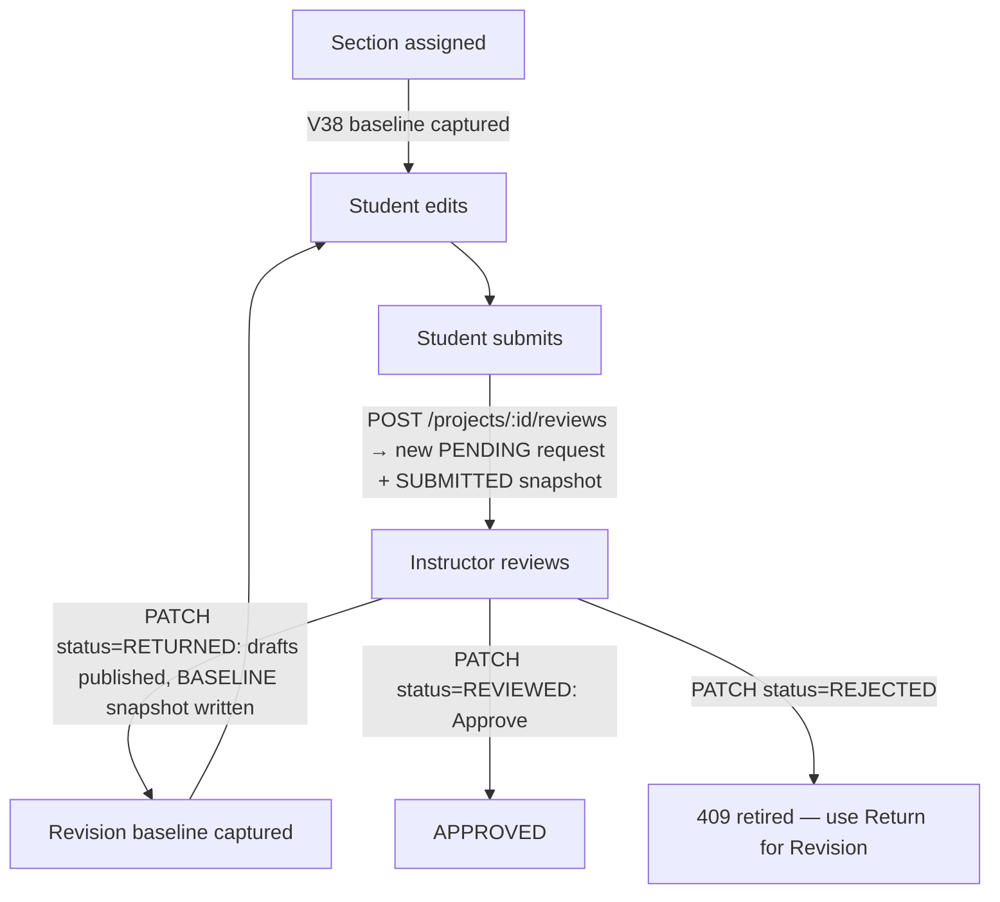
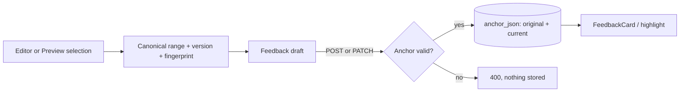
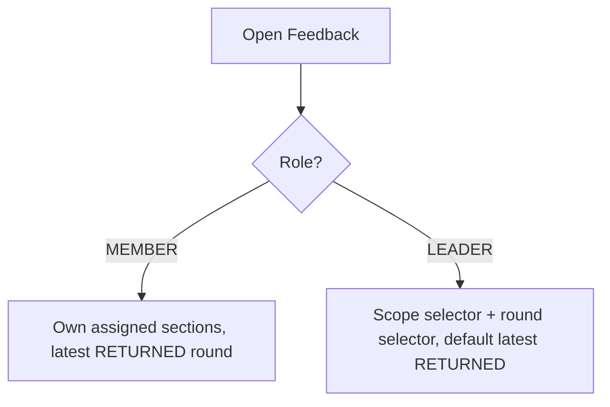

# Working Session Handoff — Evidence Pilot

## Working Session Summary

| Field | Value |
|---|---|
| Project | Evidence Pilot (Java 21 / Spring Boot 3.3.5 · React 19 + Vite 8 + Tailwind 4 · MySQL 8) |
| Area | Student Workspace + Instructor Review Workspace (feedback, rounds, baselines, diff, Preview mapping, polish) |
| Session goal | Convert the review workspace from a two-way conversation workflow into exact, round-scoped, one-way review feedback with correct revision baselines, precise passage anchoring (editor + Preview), and a cleaned-up Student/Instructor UI |
| Start commit | `dfa1d70` — feat: capture immutable first-handoff baseline per section |
| End commit | `205ebb9` — Merge branch 'main' (HEAD; includes remote test-reorg merge `15a4b0b` + `bba652d` fix: test maven) |
| Primary result | One-way review feedback end to end: correct handoff baselines, server-resolved comparison source, canonical passage anchors from editor and Preview, round-scoped visibility, retired reply/reject machinery, stacked Student cards, simplified Instructor composer |
| Backend status | IMPLEMENTED — writes for replies/state/reject removed; reads retained for legacy rows; anchor contract enforced (400); comparison source server-resolved |
| Frontend status | IMPLEMENTED — no new dependencies; exact Preview mapping on both renderers; honest refusal where unmappable |
| Database/migration impact | 1 new migration (`V38__assignment_section_baselines.sql`); no columns dropped; legacy tables retained read-only |
| Test status | FE 167/167 PASS · BE 991 run, 0 fail, 1 error (remote-caused, see Known Issues), 1 skipped · Playwright 51/51 PASS (all run at HEAD `205ebb9`) |

Most important outcomes:

- Simplified Instructor feedback from a reply/resolve/reject conversation into one-way review feedback; all conversation write paths deleted on both sides.
- Fixed Show Diff structurally: comparison now resolves server-side against the true handoff baseline instead of diffing rows inside one request.
- Added immutable first-assignment baselines (`assignment_section_baselines`, V38) so the first review cycle has a correct baseline.
- Scoped Student feedback to one round at a time with MEMBER/LEADER enforcement on both server and client; removed status workflow and flat-history fetching.
- Made passage anchors canonical (`latex-source-lf-v1`/`utf16` + version + SHA-256 fingerprint) with server-side 400 rejection of stale/malformed anchors.
- Mapped Preview selections to exact source ranges on both renderers (markdown span map; legacy structural zip) with honest refusal instead of text search.
- Rebuilt History as previous-round cards, retired request-Reject (409), added sticky auto-arm + explicit Change-Passage FAB confirmation.
- Replaced the Student anchored-card layout with stacked cards and same-row filters; moved Instructor attachments below the message.
- Merged remote `origin/main` test reorganization (contract/infrastructure/mainflow tiers); kept all local coverage green.

## Session Timeline

| Phase | Problem / Goal | Audit / Decision | Implementation | Verification | Commits |
|---|---|---|---|---|---|
| Audit | Unknown review-workflow state | Read-only audit proved: diff compared rows inside one request (always ≈empty); reply/ack layer contradicted one-way contract | Audit doc + plan (later removed after execution) | Code-trace evidence only | `09e9599` |
| First-handoff baseline | First review cycle had no baseline at all | Product decision: capture immutable baseline at assignment; insert-if-absent; no backfill for legacy rows | `AssignmentSectionBaseline` entity + repository, capture on assign, V38 | `AssignmentBaselineCaptureTest` (5 tests) | `dfa1d70`, `0fde9c8` |
| Comparison source | FE diffed BASELINE vs SUBMITTED within one request | Product decision: server resolves `latest earlier RETURNED BASELINE ?? initial assignment baseline ?? null` | `getComparisonSource()` + `ComparisonSourceDto` + `GET …/comparison-source` | `ComparisonSourceTest` (9 tests incl. v4→v5) | `2c0a0c2`, `1b97cbc`, `67e75cf` |
| Conversation removal | Replies, resolve/reject/reopen, ack buttons live | Product decision: one-way feedback; deactivate writes, keep legacy reads | Deleted controllers paths, service methods, DTOs, repo, FE composer/buttons/paths | Service + controller tests updated; full suite green | `18d3e04`, `3474aeb`, `15443f2`, `fdbf4c7` |
| Overlap | Overlapping ranges had no defined behavior | Decision: allowed, warn-only, never auto-merge/split | `feedbackOverlap.js` (`findOverlaps`) + notice UI | `feedbackOverlap.test.js` + overlap e2e | `a10fccc` |
| Editor stickiness + Preview visibility | Selection lost when Preview opened | Decision: draft-owned sticky target | `autoCaptureSelection`, armed passage survives Preview | FAB specs | `256d9f4`, `f8e2b3f` |
| History | Only metadata / single card | Decision: all previous-round cards, shared component | `historySelector.js` (`selectPreviousCards`) + read-only `FeedbackCard` | History e2e | `2d705ea`, `7485690` |
| Round scoping | All rounds flattened in FE; weak member scoping | Decision: one selected round; server enforces member section scope | `reviewRounds.js`, scoped fetching, `getFeedbackItems(requestId, sectionId)` member check | Visibility + round specs | `6eea7d5`, `cc03929`, `83fb2a2`, `ca96624`, `fdc5108` |
| Edit + Reject | Passage editing unclear; Reject redundant with Return | Decision: inline edit with explicit Change Passage; Reject → 409 | `handleEditFeedback` seeding, retired `rejectReview` | Edit/change-passage e2e | `8eba6a5`, `b6fcc26` |
| Preview mapping (Plan B) | Preview selections unmappable or indexOf-guessed (phantom duplicates) | Decision: exact maps or honest refusal; never text search | `previewSelection.js`, `rehypeSourceOffsets`, `latexSourceMap.js` (scanner + structural zip), PreviewPane wiring | Probe/offset/range unit tests + mapping/refusal/parity e2e | `ed8711e`, `0f8a592`, `97e66ec`, `37c2d83`, `5aff5a7`, `8fa1022`, `eedb19b`, `ee0d869` |
| Anchor contract | Stale anchors could save silently | Decision: BE 400s are the backstop; FE guard unreachable by construction (draft keys + immutable snapshots) | `FeedbackAnchorService.create()` validation; contract tests | `FeedbackAnchorServiceTest` +7 | `ba6799d` |
| Final polish | Whitespace, connector, Go-to dropdown, attachment order, redundant buttons | Decision: stacked cards, shared composer reorder, FAB confirm | FeedbackPanel rewrite, composer reorder, `isAdjustingPassage` FAB branch | Visibility + selection specs | `3918e21`, `529cd32`, `612bc3f`, `cc72a93` |
| Remote interleave | Teammate test reorg + fixes on `origin/main` | Decision: accept reorg, keep all local coverage | Merges `15a4b0b`, `205ebb9` (kept renamed BE tests + restored `FE/e2e`) | Full suite re-run at HEAD | `8c03ed0`, `946cc13`, `abba569`, `bba652d`, `15a4b0b`, `205ebb9`, `393031c` |

## Architecture Before vs After

| Area | Before | After | Reason |
|---|---|---|---|
| Feedback interaction | Reply composer, resolve/reject/reopen buttons, student IMPLEMENTED/WONT_FIX ack | One-way Instructor feedback; legacy replies read-only | Student only reads, fixes, resubmits |
| Diff baseline | FE diffed BASELINE vs SUBMITTED rows inside one request (≈empty after any revision) | Server resolves true handoff baseline; FE diffs baseline vs submission | Instructor sees actual changes since last handoff |
| First-cycle baseline | None existed | Immutable per-section row at assignment (V38) | First review needs a comparison point |
| Student feedback | All rounds flattened; per-round fan-out; status filter | One selected round (default latest RETURNED); server member-scope check | Noise reduction; real authorization |
| History | Metadata / single card | All previous-round section cards, shared read-only component | Reviewers need full prior context |
| Passage anchors | Editor offsets; Preview unmappable or guessed | Canonical contract (version + fingerprint); Preview maps exactly or refuses | No phantom-duplicate mis-anchoring |
| Passage editing | Unclear / standalone re-anchor | Inline edit, seeded from stored original; explicit Change-Passage FAB confirm | No accidental retargeting |
| Reject | Separate request-level REJECTED flow | Retired (409 "use Return for Revision"); old rows readable | Return covers revision; one fewer state |
| Student panel | Absolute anchor-mirrored cards, connector line, Go-to dropdown | Stacked cards, same-row filters | Compact, no phantom whitespace |
| Test layout (remote) | Flat `BE/src/test/java/com/evidencepilot/**` | `mainflow/` + `contract/` + `infrastructure/` tiers (packages unchanged) | Organizational; needs `bba652d` pom tiers to compile |

## Review Lifecycle

Real statuses (`FeedbackStatus`: `PENDING`, `RETURNED`, `REVIEWED`, `REJECTED`; `ProjectStatus`: `CREATED → ASSIGNED → IN_PROGRESS → SUBMITTED_FOR_REVIEW ⇄ RETURNED → APPROVED → ARCHIVED`).



- **First assignment:** assigning a section inserts the `assignment_section_baselines` row once (`UNIQUE(project_id, section_id)`); reassignment/unassign never alter it.
- **First submission:** `submitForReview()` (`FeedbackServiceImpl.java:107`) creates a PENDING `feedback_requests` row with `submissionSnapshotJson` and a SUBMITTED `review_section_snapshots` row.
- **Instructor review:** workspace loads the active request plus the immediately previous one (`previousRequest`); feedback create/update via `POST /feedback-requests/{id}/feedback` and `PATCH /instructor-feedback/{id}`, both validated by `FeedbackAnchorService.initialize()`.
- **Return for Revision:** `returnReview()` (`:363`) publishes drafts and writes the BASELINE snapshot on the returned request.
- **Revision baseline:** the next review's comparison source is that BASELINE.
- **Student resubmit:** creates a new PENDING request (a new round); drafts are keyed per request so nothing stale carries over.
- **Next review / Approve:** `approveReview()` (`:397`); no thread-closure gate remains.
- **Legacy Reject:** `case REJECTED -> throw conflict("Review rejection is retired; use Return for Revision.")` (`:358`, HTTP 409). Stored REJECTED rows stay readable; `FeedbackStatus.REJECTED` and `FeedbackThreadState.REJECTED` remain for history.

## Show Diff and Baseline Semantics

Final invariant: **the Instructor compares the current Student submission against the state of the work when it was last handed to the Student.**

- **First cycle:** initial handoff baseline (V38 row) vs first submitted version.
- **Later revision cycles:** latest earlier RETURNED BASELINE (from `review_section_snapshots`) vs current submitted version.
- **Storage:** `assignment_section_baselines` (V38, insert-if-absent, no backfill) + `review_section_snapshots` rows (`SUBMITTED` at submit, `BASELINE` at return).
- **Resolver/API:** `FeedbackServiceImpl.getComparisonSource()` (`:281`) served at `GET /api/feedback-requests/{id}/comparison-source` as `ComparisonSourceDto`; empty text is a valid baseline, row absence means unavailable.
- **Frontend pipeline:** `useInstructorReview` fetches the comparison source; `wordDiff` diffs normalized sources; `PreviewPane`/`LatexEditor` render highlights; Preview refuses diff rendering on unmappable content and falls back to full-span display only.
- **Legacy fallback:** projects without any baseline show an honest "comparison baseline unavailable" state — never invented data.
- **Why the old approach was wrong:** it diffed BASELINE vs SUBMITTED rows stored on the *same* request, but the backend writes BASELINE on the returned request and SUBMITTED on the new one — so request A diffed a submission against itself and request B had no baseline.
- **Concrete example (v4 → v5):** `ComparisonSourceTest.versionFourToFiveResolvesExactSourceStrings` pins that comparing submitted v5 against the v4 handoff highlights exactly the changed strings, and truncation yields `ranges: []` rather than guessed highlights.

## Instructor Feedback Data Flow

```text
Editor selection (selection.main.from/to) or Preview selection (span map / structural zip)
→ canonical range {from, to} → draft anchor {contentVersion, fingerprint = SHA-256(normalized source)}
→ POST /feedback-requests/{id}/feedback (or PATCH /instructor-feedback/{id})
→ FeedbackServiceImpl → FeedbackAnchorService.initialize() validates representation/offsetUnit/version/fingerprint/bounds (400 otherwise)
→ InstructorFeedback.anchor_json {original (immutable target) + current (projection)}
→ response DTO → mergeThread() → FeedbackCard / editor highlight
```

- **Whole-section feedback:** null anchor → `SECTION` projection; composer shows "Whole section".
- **Passage feedback:** anchored range; line label via `selectionLines` ("Line N" / "Lines a–b").
- **Editing:** `handleEditFeedback` seeds the draft from the stored *original* passage, never the live-resolved position.
- **Reselection:** Change passage → adjust mode → editor selection → FAB "Use this passage" confirms into the draft only; Update persists (same id), Cancel discards; Remove passage drafts whole-section.
- **Attachments:** picked from the project library (`MediaAssetPicker`, max 5); backend clones bytes into feedback-owned keys; strip renders under the message with per-thumbnail remove.
- **Overlap:** `findOverlaps` warns (exact-duplicate wording is stronger) but never blocks; items stay independent; editor highlights remain clickable with select-first determinism.
- **Round ownership:** create requires the latest PENDING/RETURNED request in submitted view; historical rounds are read-only.

## Overlapping Feedback

Example from `review-feedback-selection.spec.js` (`OVERLAP_SENTENCE = 'The man has hooked a fish'`): Feedback A covers 0–24, Feedback B covers "fish" at 20–24.

- Overlapping feedback is allowed; exact-duplicate ranges are allowed.
- Items remain independent (separate ids, separate anchors, separate save paths).
- The composer shows a non-blocking notice ("This selection overlaps N existing feedback item(s)" / "This exact passage already has feedback") with a link to view the first overlapping item.
- Editor highlights for all in-scope items render (`cm-feedback-range` with `data-feedback-id`); clicking a highlight selects the first match deterministically.
- Automatic merge/split was rejected: merging destroys authorship and independent lifecycles; the notice gives the human the information instead.

## Student Workspace

### MEMBER

- Sees only feedback on sections assigned to them in the selected round (`FeedbackPanel.jsx` filter mirrors the server rule; `FeedbackServiceImpl.getFeedbackItems(requestId, sectionId)` enforces section scope server-side — a cross-section fetch is rejected).
- Sees one round at a time; the client fetches only the selected round's threads (no fan-out).
- No status filters, no round controls beyond the round label; historical rounds are not fetched in the member view.
- UI is now stacked cards directly under a same-row filter grid (scope + round), no connector, no Go-to dropdown.

### LEADER

- Whole-project visibility available via the scope selector (`section` / `project`); sees assignee names on cards.
- Selects one round at a time from the round dropdown; defaults to the latest RETURNED round.
- Same stacked-card UI; cross-section cards offer "Go to passage".

| Role | Own sections | Whole project | Latest returned | Older rounds |
|---|---|---|---|---|
| MEMBER | Yes (assigned only, server-enforced) | No | Yes (default; only round fetched) | Not exposed |
| LEADER | Yes | Yes (manual scope switch) | Yes (default) | Yes (one at a time via selector) |

## Instructor Review Workspace

- **Active request selection:** central selectors (`reviewRounds.js`: `latestReturnedRequest`, `previousRequest`, `roundNumberFor`); the workspace loads the active request plus the immediately previous one — never the full history.
- **Feedback tab:** active-round threads for the section; create composer (auto-arm on editor selection with line label), inline edit cards, overlap notices, attachments under the message.
- **History tab:** all previous-round cards for the section via `selectPreviousCards` + shared read-only `FeedbackCard`, newest first; unpublished drafts excluded.
- **Previous vs current vs older:** previous returned round → History cards + carry-over highlights; current active request → editable Feedback tab; older (N-2+) rounds → never fetched (proven by `feedbackCalls` assertions).
- **Editor highlighting:** `ATTACHED`/`MODIFIED` ranges render in `LatexEditor`; `DETACHED` shows the original excerpt struck through on the card.
- **Show Diff:** toggle resolves the comparison source server-side; honest unavailable state for legacy projects.
- **Return for Revision / Approve:** modal confirm; Return publishes drafts + writes BASELINE; Approve has no thread-closure gate.
- **Reject:** retired (409); button removed.
- **Create/edit:** as in Feedback Data Flow; Preview selections arm the same canonical contract.

## Feedback History

- "Previous round" = the nearest earlier request in `orderedRequests` (`previousRequest`), regardless of status.
- All of that round's published cards for the current section are shown (multi-card), newest first, through the same `FeedbackCard` component in read-only mode.
- Filtering is by current section and active-vs-previous request id.
- Older rounds are not flattened in because flattening destroys round semantics, reintroduces noise the round model was built to remove, and duplicates what History already scopes; on-demand single-thread fetch covers deep links.

## Retired Workflow and Legacy Compatibility

| Feature | UI removed? | Write API removed? | Service code removed? | Legacy data retained? | DTO fields retained? | Reason |
|---|---|---|---|---|---|---|
| Instructor reply composer + `postReply` | Yes (`3474aeb`) | Yes (`POST …/replies` gone, `18d3e04`) | Yes (`postReply`, `notifyReply`) | Yes, rows + `replies[]` read DTO | Yes (`replies[]`) | One-way contract; history must stay visible |
| Thread resolve/reject/reopen + `pendingState` machine | Yes (buttons; state chip was already gone) | Yes (`PATCH …/state`, `prepareFeedbackState`) | Yes | Yes (states on old rows) | Minimal | Obsolete workflow |
| Student IMPLEMENTED/WONT_FIX ack | Yes | Yes (`applyStudentState`) | Yes | Yes (columns) | Yes | Students never mutate feedback |
| `FeedbackReplyRequest`, `FeedbackStateRequest`, `PostReplyResult`, `FeedbackReplyRepository` | n/a | n/a | Deleted (`fdbf4c7`, `18d3e04`) | n/a | n/a | Dead with the endpoints |
| Request-level Reject | Yes (button) | Turned into 409 | `rejectReview` deleted | Yes (old REJECTED rows readable) | Status enum kept | Return covers revision |
| `Go to feedback (N)` dropdown | Yes (`3918e21`) | n/a (client-only) | n/a | n/a | n/a | Cards are directly visible |
| Connector line / anchored cards | Yes | n/a | `placeFeedbackCards` deleted | n/a | n/a | Caused phantom whitespace |
| `Use editor selection` / `Use new selection` / `Keep current` | Yes (`529cd32`, `612bc3f`) | n/a | Hook fn kept for FAB | n/a | n/a | Auto-arm + FAB confirm replace them |
| Standalone re-anchor store (`reanchorStore.js`) | n/a | n/a | Deleted | n/a | n/a | Reselection lives inside edit |
| Thread-state filters, status chips | Yes (`ca96624`) | n/a | n/a | n/a | Some (`threadState`) | No workflow left to filter |

Legacy tables/columns (`feedback_replies`, `reply_id` attachment links, `threadState`/`pendingState`, `studentStatus`/`studentNote`, `V27`/`V34` constraints) are intentionally retained: dropping them would destroy history or orphan files.

## Database Changes

One migration added this session; no columns/tables dropped.

```text
Migration: BE/src/main/resources/db/migration/V38__assignment_section_baselines.sql
Purpose: immutable first-handoff baseline per section for the first review cycle
Tables/columns: new table assignment_section_baselines
  (id, project_id, section_id, content_tex, content_version, created_at,
   UNIQUE(project_id, section_id), fk → projects/paper_sections CASCADE)
Why required: no prior baseline existed for cycle 1, so Show Diff had nothing correct to compare
Backfill: none — legacy assignment-time content cannot be reconstructed honestly;
  absence surfaces as "comparison baseline unavailable"
Legacy impact: none (new table only)
Rollback implications: dropping the table reverts first-cycle diff to unavailable-state
```

All other session features required **no schema change** (anchors live in `anchor_json`; snapshots in existing `review_section_snapshots`; round semantics from `feedback_requests` rows).

## Backend Changes

**Review lifecycle** — `service/impl/FeedbackServiceImpl.java`: `submitForReview()` (`:107`) snapshots SUBMITTED; `returnReview()` (`:363`) publishes drafts + writes BASELINE; `approveReview()` (`:397`) without thread-closure gate; `REJECTED → 409` (`:356-358`); `FeedbackController.java` documents the retirement and drops reply/state endpoints.

**Comparison-source resolution** — new `getComparisonSource()` (`:281`) + `ComparisonSourceDto`; `GET /feedback-requests/{id}/comparison-source` (`FeedbackController.java:115`); entity + repository `AssignmentSectionBaseline(Repository)`; capture on assignment.

**Feedback authorization** — `getFeedbackItems(requestId, sectionId)` enforces `section.assignedUser` membership for non-leaders; no historical assignee column exists, so reassignment transfers visibility by construction.

**Feedback writes** — create/update funnel through `FeedbackAnchorService.initialize()`; anchor contract (`latex-source-lf-v1`/`utf16`, version + fingerprint + bounds) violations → 400 "Anchor does not match the reviewed source."; remap/recover logic for post-edit projections retained.

**Legacy compatibility** — `feedback.getReplies()` lazy read retained (`:637`); `replies[]` in `InstructorFeedbackResponseDto` retained; reply/state write code and dead DTOs/repos deleted.

Tests: `AssignmentBaselineCaptureTest` (5), `ComparisonSourceTest` (9), `FeedbackAnchorServiceTest` (+1 contract case = 7), revision/publication/controller suites updated for removed paths.

## Frontend Changes

**Instructor Review Workspace** — `hooks/useInstructorReview.js`: two-round loading, `commitPreviewSelection`, `captureSourceSelection`/`autoCaptureSelection`, `isAdjustingPassage` + start/cancel/confirm, draft keyed `[project, request, section]`. `EditorPanel.jsx`: FAB portal branches create (message-plus) vs adjust-confirm (chat check); edit-mode non-adjust selections raise nothing; Preview refusal banner.
**Student Workspace** — `components/Student/FeedbackPanel.jsx`: stacked `space-y-3` cards, always-visible `grid-cols-1 sm:grid-cols-2` filters, member/leader scoping display; `hooks/useProjectFeedback.js`: single-round fetch; `WorkspaceLayout.jsx`: latest-RETURNED default, card→editor reveal kept.
**Feedback cards** — shared read-only `review/FeedbackCard.jsx` (location chip, struck-through original on DETACHED/MODIFIED, `AttachmentThumbs`, legacy `ReplyList`); active ring kept.
**Filters** — no status filter; round selector reuses `reviewRounds.js`; defaults untouched (section + latest RETURNED).
**Passage handling** — canonical anchor everywhere; `selectionLines` labels; inline edit seeded from stored original; Change-Passage FAB confirm writes draft only.
**Attachments** — `MediaAssetPicker` moved whole below the textarea with `Attachments` header (create + edit via shared `composerForm`); remove-× unchanged.
**History** — `historySelector.js` + History tab multi-card.
**Diff rendering** — `wordDiff` normalized diff; `latexHtml.js` change highlights; Preview gated fallback.

## Key Design Decisions

| Decision | Considered alternative | Chosen approach | Why |
|---|---|---|---|
| One-way feedback | Keep replies with moderation | Delete write paths, keep reads | Replies contradicted the review contract; history preserved without the machinery |
| Latest-RETURNED default, one round loaded | Load all rounds, filter client-side | `reviewRounds.js` + single-round fetch | Flattening reintroduced noise; server enforces scope |
| Reselection via FAB confirm | Drag-resize passage handles | Explicit adjust mode + floating confirm | Drag is imprecise on source text and invites accidents |
| No generic annotation framework | Build reusable range toolkit | Per-surface minimal code | One consumer per mechanism; YAGNI |
| Keep legacy reply persistence | Migrate/drop old rows | Retain tables read-only | History and attached files must survive |
| Exact Preview map or refusal | `indexOf` snippet search | Span map (markdown) + structural zip (legacy) | Search collapses duplicates to first occurrence (phantom-duplicate bug) |
| No Bootstrap / icon packages | Add deps for button + icon | Tailwind `bg-rose-600` + inline SVG | One button/icon never justifies a dependency |
| FE staleness guard skipped | Pre-POST version check + warning UI | BE 400s as backstop only | Unreachable by construction (draft keys + immutable snapshots + locked history) |
| No backfill for V38 | Synthesize baselines for old projects | Honest unavailable state | Invented baselines would corrupt diffs silently |

## Audit Findings

| Finding | Severity | Evidence | Resulting change |
|---|---|---|---|
| Diff compared rows inside one request (≈empty after revision) | P0 | `useInstructorReview.js:260-268` vs `FeedbackServiceImpl.java:141-142,451-453` (audit at `78003a7`) | Server-resolved comparison source (`2c0a0c2`, `1b97cbc`, `67e75cf`) |
| Reply/ack layer live against one-way contract | P2 | Composer, `postReply`, ack buttons traced end to end | Write paths deleted, reads kept (`18d3e04`, `3474aeb`) |
| Approve gated on obsolete thread closure | P1 | `approveReview` all-closed check | Gate removed (`18d3e04`) |
| History showed metadata/single card | P2 | Inline History block | Multi-card shared component (`2d705ea`, `7485690`) |
| Preview unmappable / guessed via search | P1 | No source map in renderers | Exact maps + refusal (`ed8711e`…`ee0d869`) |
| Student endpoint exposed project-wide feedback | P1 | Missing section-scope check | Server member check (`cc03929`) |
| Approvals depended on thread state UI | P1 | State buttons + chips | Buttons removed, chips removed (`ca96624`) |
| Anchored cards caused phantom whitespace + connector | P2 | Absolute Y-mirrored layout + SVG | Stacked list (`3918e21`) |

## Change Inventory

Session range `78003a7..HEAD`: 186 files, +5163/−1764 (includes the remote test-tier renames, which dominate raw counts).

**Backend (main)** — `controller/FeedbackController.java` (reply/state endpoints removed, comparison-source + retirement docs added); `service/impl/FeedbackServiceImpl.java` (lifecycle, comparison source, auth scoping, no thread gate, no reject); `service/impl/PaperProcessingServiceImpl.java`, `service/AdminExcelSeedService.java` (adapted); deleted `dto/request/FeedbackReplyRequest.java`, `dto/request/FeedbackStateRequest.java`, `dto/response/PostReplyResult.java`, `repository/FeedbackReplyRepository.java`; added `dto/response/ComparisonSourceDto.java`, `model/AssignmentSectionBaseline.java`, `repository/AssignmentSectionBaselineRepository.java`.

**Database** — added `V38__assignment_section_baselines.sql` (only migration).

**Frontend** — rewritten `Student/FeedbackPanel.jsx`; `Student/EditorPanel.jsx` (FAB branch, measurement removal); `features/LatexEditor.jsx` (dead change-notify removed; highlights kept); `features/PreviewPane.jsx` (normalized source, offset plugin, legacy branch); `Instructor/review/FeedbackThreadsTab.jsx` (composer reorder, passage controls, adjust mode); new `Instructor/review/FeedbackCard.jsx`, `utils/previewSelection.js`, `utils/reviewRounds.js`, `utils/formatters/latexSourceMap.js`, `utils/instructor/feedbackOverlap.js`, `utils/instructor/historySelector.js`; `hooks/useInstructorReview.js`, `hooks/useProjectFeedback.js`, `WorkspaceLayout.jsx`, `feedbackKeys.js`, `markdownBlocks.js`, `latexHtml.js`, `wordDiff.js`, `feedbackAnchors.js` modified; deleted `stores/reanchorStore.js`, `placeFeedbackCards`; locales EN/VI updated.

**Tests** — new e2e: `preview-source-mapping`, `preview-refusal`, `preview-parity`, `review-feedback-selection`, `student-feedback-visibility` specs (restored after remote dir deletion; `feedback-anchor-fab` kept); new unit: `previewSelection`, `reviewRounds`, `latexRange`, `latexSourceMap`, `samples`, `sourceMapProbe`, `sourceOffsets`, `feedbackOverlap`, `historySelector`, `selectionLines` tests; `wordDiff`, `feedbackAnchors`, `localizationCatalog` tests updated; BE tests reorganized into `mainflow/`/`contract/`/`infrastructure/` (remote) with our `ComparisonSourceTest`, `AssignmentBaselineCaptureTest`, `FeedbackAnchorServiceTest` cases intact.

**Documentation** — added `docs/superpowers/plans/2026-09-18-final-feedback-ui-polish.md`; added then removed the session audit + major-changes plan after execution (`393031c`); remote added test-tier README section.

## Commit Inventory

Session commits (`dfa1d70` → `393031c`, local) plus remote interleave and merges. Logical groups: baseline (`dfa1d70`, `0fde9c8`); comparison source (`2c0a0c2`, `1b97cbc`, `67e75cf`); audit/plan (`09e9599`); conversation removal (`18d3e04`, `3474aeb`, `15443f2`, `fdbf4c7`); overlap (`a10fccc`); stickiness (`256d9f4`, `f8e2b3f`); history (`2d705ea`, `7485690`); round scoping (`6eea7d5`, `cc03929`, `83fb2a2`, `ca96624`, `fdc5108`); edit/reject (`8eba6a5`, `b6fcc26`); acceptance tests (`fb0a797`); Preview mapping (`ed8711e`, `0f8a592`, `97e66ec`, `37c2d83`, `5aff5a7`, `8fa1022`, `eedb19b`, `ba6799d`, `ee0d869`); polish (`3918e21`, `529cd32`, `612bc3f`, `cc72a93`); doc removal (`393031c`).
Remote: `946cc13` reference-check route in contract test; `abba569` model tunnel fixture refresh; `8c03ed0` test cleanup/reorg; `bba652d` pom test tiers (build-helper). Merges: `15a4b0b` (reorg into local), `205ebb9` (HEAD).

## Automated Verification

All commands below were executed at HEAD `205ebb9` for this handoff (timestamps 2026-09-18).

| Command / Test | Scope | Result | What it proves |
|---|---|---|---|
| `npm test` (FE) | 167 node tests | PASS | Anchors, rounds, diff, overlap, history, preview maps, locale catalog |
| `npm run build` (FE) | Vite production build | PASS | No dead imports/JSX breakage from deletions |
| `mvn test` (BE) | 991 tests incl. Docker Testcontainers MySQL suites (Flyway ×3, PaperReference ×1, publication, revision…) | 990 PASS-equivalent, 0 fail, **1 error**, 1 skipped | Full backend green except one remote-caused error (below); Docker suites actually ran and passed |
| `ProjectRouteMappingTest.exposesExactlyTheDocumentedRoutes` | Route allowlist | ERROR (remote defect) | `946cc13` listed `GET /api/papers/{paperId}/references/check` twice → `Set.of` duplicate; unrelated to session work; recorded, not fixed (docs-only task) |
| `SourceMapBackfillTest` | 1 skipped | SKIPPED | Pre-existing assumption-based skip |
| `npx playwright test` (FE/e2e) | 51 tests, real Chrome + dev server | 51 PASS | Visibility, selection, edit, change-passage, preview mapping/refusal/parity, history, overlap |

Historical (labeled, not re-claimed): pre-merge runs at `ee0d869` (FE 167, BE 991 with 27 Docker-skips, e2e 45) and phase runs per commit recorded in session notes.

## Test Coverage Added During This Session

- **Assignment baseline capture** — `AssignmentBaselineCaptureTest`: capture-once, reassignment-safe, unassign writes nothing, batch only new sections.
- **Return → edit → resubmit → Show Diff** — `FeedbackRevisionMySqlTest` chain + `fb0a797` acceptance: baselines across the full cycle.
- **Comparison resolution incl. v4→v5** — `ComparisonSourceTest`: handoff-vs-submission strings, truncation honesty.
- **Member cross-section authorization** — service tests + `student-feedback-visibility.spec.js` (member sees only own; leader sees all one round at a time).
- **Round scoping** — `reviewRounds.test.js`, single-round fetch assertions (`feedbackCalls` never contain older rounds).
- **Overlapping feedback** — `feedbackOverlap.test.js` + nested/exact-duplicate e2e (warn, save anyway).
- **Edit passage replacement** — reselect/Escape/Cancel/Update matrix in `review-feedback-selection.spec.js`.
- **History multi-card** — previous-round cards read-only, drafts excluded.
- **Preview selection** — probe/offset/range unit tests; mapping/refusal/parity e2e incl. second-duplicate-fish exactness on both renderers.
- **Anchor contract 400s** — stale version, fingerprint mismatch, malformed shapes.
- **Student layout + composer polish** — stacked-list, same-row filters, attachment order/removal, passage-controls row.

## Manual Verification Walkthrough

### Scenario A — Initial Review

1. Assign a section to a student → `assignment_section_baselines` gains one row (check `content_tex` = assignment text).
2. Student edits, then submits → new PENDING request with snapshot; project `SUBMITTED_FOR_REVIEW`.
3. Instructor opens Review Workspace (`/instructor/requests/:projectId`) → editor shows submission.
4. Enable Show Diff → changes highlight relative to the assignment baseline (first cycle).
5. Select editor text → composer auto-arms ("Line N"); or select Preview text → same arming; unmappable Preview content (math, headings) shows the honest banner.
6. Type message, Add media → pick images → strip appears under the textarea; remove one with ×; Save feedback.
7. Return for Revision → drafts publish, BASELINE snapshot written, project RETURNED.

### Scenario B — Revision

1. Student opens Feedback → sees latest RETURNED round only, own sections only.
2. Student edits, resubmits → new PENDING request (new round).
3. Instructor Show Diff → highlights only last-handoff changes (v4→v5 semantics).
4. History tab → previous-round cards, read-only.
5. Edit a feedback → Change passage → select → FAB "Use this passage" → label updates → Update persists same id; Cancel after confirm changes nothing.
6. Approve → project APPROVED. (Reject attempt → 409.)

### Scenario C — Role Visibility

- MEMBER: own sections, latest returned round, no round dropdown, no status UI.
- LEADER: scope switch (section/project), round dropdown defaulting to latest RETURNED, assignee names, one round at a time.

### Scenario D — Edge Cases

- Overlapping feedback: two ranges on "…hooked a fish" → both save; notice shows; highlights clickable.
- Whole-section feedback: save with no selection → "Whole section".
- Legacy round/project without baseline: diff shows unavailable-state, never fabricated highlights.
- Stale anchor POST (hand-crafted version/fingerprint mismatch): 400, nothing stored.

## Important API Flow

| Action | Method | Endpoint | Caller | Service | Result |
|---|---|---|---|---|---|
| Submit / resubmit | POST | `/api/projects/{id}/reviews` | Student workspace | `submitForReview()` | New PENDING request + SUBMITTED snapshot |
| List threads (scoped) | GET | `/api/feedback-requests/{id}/feedback` | Both panels | `getFeedbackItems()` (member check) | Single-round threads |
| Comparison source | GET | `/api/feedback-requests/{id}/comparison-source` | Show Diff | `getComparisonSource()` | `{submitted, baseline\|null}` |
| Create feedback | POST | `/api/feedback-requests/{id}/feedback` | Composer | `initialize()` anchor check | Thread DTO (400 on bad anchor) |
| Edit feedback | PATCH | `/api/instructor-feedback/{id}` | Edit card | `initialize()` on anchor change | Updated thread DTO |
| Deep-link thread | GET | `/api/instructor-feedback/{id}` | Deep link | single-thread read | Thread DTO |
| Transition | PATCH | `/api/feedback-requests/{id}/status?status=` | Return/Approve modal | `returnReview()`/`approveReview()`; REJECTED→409 | New statuses + snapshots |
| Media library / URLs | GET / POST | `/api/media/projects/{id}`, `/api/media/urls` | Picker | media services | Assets + presigned URLs |

## Data Flow Diagrams

Review lifecycle and Show Diff diagrams are in their sections above. Feedback create/edit:



Student visibility:



## Known Limitations and Deferred Work

- **Remote `ProjectRouteMappingTest` duplicate route.** Status: KNOWN LIMITATION (pre-existing at HEAD, caused by remote `946cc13`, fails `mvn test` with 1 error). Why deferred: documentation-only task forbids code fixes. Safe behavior: single-test error; all other 990 pass. Future: delete one of the two identical lines (test file lines ~119/122).
- **FE staleness guard intentionally not built.** Status: DEFERRED by design. Draft keys + immutable snapshots + locked history make stale saves unreachable; BE 400s backstop hand-crafted calls. Future: add only if a reachable stale path appears.
- **Legacy reply/state columns and tables retained.** Status: LEGACY (intentional). Future: drop only via dedicated migration after confirming no reader needs them.
- **Legacy projects lack V38 baselines.** Status: honest unavailable-state (not a bug). Future: none — do not backfill.
- **Preview prose outside constructs unmappable (legacy renderer).** Status: honest refusal banner. Future: renderer emitting fine-grained maps.
- **Docker-dependent tests need a daemon.** Status: environment-dependent; they ran and passed here. Future: none.

## Invariants Future Changes Must Preserve

- Do not flatten all feedback rounds into one active feed.
- Do not rely on frontend-only filtering for Member authorization (server check in `getFeedbackItems` is the gate).
- Do not recreate reply/resolve/acknowledgement write paths.
- Do not treat empty baseline content as missing baseline (row existence = availability).
- Do not destroy legacy reply history or attachment rows because active replies are gone.
- Do not use text search to guess a Preview source range (duplicates collapse to first occurrence).
- Do not reset the V38 initial baseline on reassignment/unassign (insert-if-absent).
- Do not reintroduce request-level Reject as a workflow (409 is intentional).
- Do not refetch/merge full thread DTOs over surgical `mergeThread` (races ghost user changes).
- Do not re-add anchored absolute positioning to the Student card list.

## If You Need to Continue This Work

Start here:

1. Read `docs/superpowers/plans/2026-09-18-final-feedback-ui-polish.md` (polish rationale) and this handoff's Timeline.
2. Inspect `BE/src/main/java/com/evidencepilot/service/impl/FeedbackServiceImpl.java` (`submitForReview`, `returnReview`, `getComparisonSource`) and `BE/src/main/java/com/evidencepilot/service/FeedbackAnchorService.java` (contract).
3. Inspect `FE/src/hooks/useInstructorReview.js` (draft keys, two-round loading, adjust mode) and `FE/src/components/Student/FeedbackPanel.jsx` (stacked list + filters).
4. Run `npm test` + `npm run build` in `FE/`; run `npx playwright test e2e/review-feedback-selection.spec.js e2e/student-feedback-visibility.spec.js`.
5. Use backend tests `ComparisonSourceTest`, `AssignmentBaselineCaptureTest`, `FeedbackAnchorServiceTest` (now under `BE/src/test/java/mainflow/…`) as executable specs.
6. Fix the known `ProjectRouteMappingTest` duplicate line first — it is the only red test at HEAD.
7. Keep new BE tests in the tier folder matching the behavior (`mainflow/` product flows, `contract/` boundaries, `infrastructure/` maintenance).

## Evidence Appendix

```text
git log range: 78003a7..205ebb9 (43 commits, 2026-09-18, single day)
git diff --stat: 186 files changed, +5163/−1764 (dominated by remote test-tier renames)
Migrations: V38__assignment_section_baselines.sql (only addition; V1–V37 untouched)
Key endpoints: POST /api/projects/{id}/reviews · GET /api/feedback-requests/{id}/feedback
  GET /api/feedback-requests/{id}/comparison-source · POST /api/feedback-requests/{id}/feedback
  PATCH /api/instructor-feedback/{id} · PATCH /api/feedback-requests/{id}/status
Key commands: (cd FE && npm test) · (cd FE && npm run build) · (cd FE && npx playwright test)
  (cd BE && mvn test) · (cd BE && mvn -Dtest=ComparisonSourceTest,AssignmentBaselineCaptureTest,FeedbackAnchorServiceTest test)
Retired symbols (verified absent): postReply, prepareFeedbackState, applyStudentState, rejectReview,
  FeedbackReplyRepository, FeedbackStateRequest, PostReplyResult, reanchorStore, placeFeedbackCards
```

---
Generated from repository state:
Branch: main
HEAD: 205ebb921ba68ed6fcf144a727f931f33821163c
Working tree: clean
Generated at: 2026-09-18 (UTC)

This report documents the repository state observed at the commit above.
Later changes may make individual implementation details stale.
(The report files themselves were committed on top with no code changes.)
